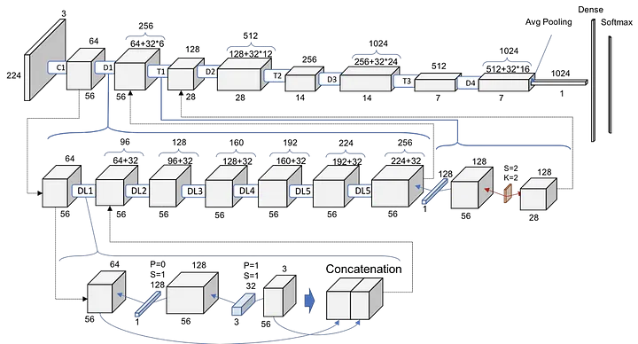
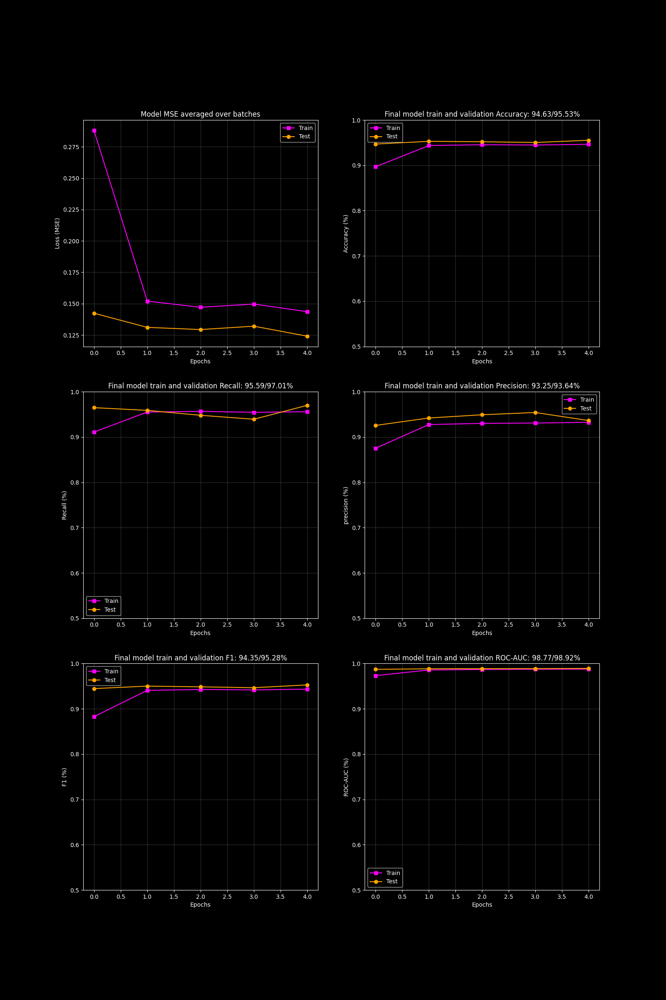

# Retinal Disease Detection using Optical Coherence Tomography and Deep Neural Networks


The healthy macula of a 24 year old male (cross-section view). This image is released to Wikimedia with patient consent. Imaged in-vivo with an Optovue iVue Spectral Domain Optical Coherence Tomographer (SD-OCT) at the office of Drs. Harry Wiessner, Steven Davis, Daniel Wiessner, and Eric Wiessner in Walla Walla, WA, USA.

Web App: [RetinaVision AI](https://retinavisionai.streamlit.app/)

## Table of contents
1. Overview
2. Model Architecture
3. Training Details
4. Dataset Information
5. Model Performance
6. Model Input and Output
7. Model limitations
8. Model Versioning
9. Dependencies
10. References
11. Authors and Contributors
12. License
13. Usage Guidelines
14. Release Date
15. Additional Notes

## Overview

This project aims to develop a deep learning model for the detection of retinal diseases from Optical Coherence Tomography (OCT) images. Optical Coherence Tomography is a non-invasive imaging technique used for high-resolution cross-sectional imaging of the retina. Early detection of retinal diseases such as age-related macular degeneration, diabetic retinopathy, and glaucoma is crucial for timely intervention and treatment.

The project utilizes pre-trained deep neural networks and transfer learning to create an accurate and robust retinal disease detection system. The DenseNet121 model, originally trained on the ImageNet dataset, serves as a powerful starting point for medical image classification tasks. In scenarios where computational resources, time constraints, and labeled data availability are crucial factors, utilizing a pre-trained model offers several advantages over training from scratch.


**1. Time and Resource Savings**: Training a deep neural network from scratch on a medical image dataset can be computationally expensive and time-consuming. Leveraging a pre-trained model allows us to benefit from the knowledge acquired during the training on a diverse and extensive dataset like ImageNet, reducing the overall training time and computational resources required.

**2. Feature Extraction Capability**:  DenseNet-121, with its deep architecture, is capable of learning hierarchical features. Its dense connectivity pattern allows it to capture hierarchical features, ranging from low-level details to more abstract and complex patterns. Lower layers capture low-level features like edges and textures, while higher layers capture more abstract and complex features. This hierarchical feature extraction is advantageous for recognizing patterns in medical images that may have both fine-grained and global characteristics.

**3. Generalization Power**: The features learned by DenseNet-121 on ImageNet are often generic and transferable to various domains. In medical image classification, where labeled datasets might be limited, the pre-trained model's ability to generalize across different image domains becomes crucial. This aids in achieving reasonable performance even with a smaller medical dataset.

**4. Fine-Tuning Flexibility**:  The DenseNet-121 model can be fine-tuned on a smaller medical dataset to specialize its knowledge for the specific task at hand. This fine-tuning process allows the model to adapt its learned features to the intricacies of medical images, improving its performance on the target domain.

**5. Overcoming Data Limitations**: Medical datasets are often smaller than general image datasets like ImageNet. Transfer learning mitigates the challenges associated with limited labeled medical data by initializing the model with weights that already capture valuable image features. This facilitates better model performance, especially when labeled medical data is scarce.

## Model Architecture
**Fine-Tuned DensNet-121 Architecture**



All feature extraction layers were frozen and only the classfication head was replaced and fine-tuned for binary classfication.

## Training Details
**Dataset**
- Training Set (98648 images)
  - ABNORMAL (52269 images)
  - NORMAL (46379 images)
- Validation Set (5194 images)
  - ABNORMAL (2753)
  - NORMAL (2441)
- Test Set (5467 images)
  - ABNORMAL (2897 images)
  - NORMAL (2570 images)
          
**Data Preprocessing steps**
- Grayscale to RGB conversion
- Resize to (256) using Bilinear interpolation
- Center Crop (224)
- Convert to PyTorch Tensors
- Normalize with mean and standard deviation values of [0.485, 0.456, 0.406] and [0.229, 0.224, 0.225] respectively.
      
**Hyperparameters used during training**
- Train batch size: 512
- Validation batch size: 256
- Test batch size: 256
- Input image size: (3, 224, 224)
- Learning Rate: 0.01
- Weight Decay: 1e-3
- Class Weights: 0.9436568520537986 (ABNORMAL), 1.0634985661614094 (NORMAL)
- Optimizer: Adam
- Loss function: Weighted Cross-Entropy Loss (wCE)
- Training epochs: 5 (193 training batches)
- Number of output units: 2
- Layer freezing: All feature extraction layers frozen.

## Dataset Information
            
**Large Dataset of Labeled Optical Coherence Tomography (OCT)**:
This dataset contains thousands of validated OCT described and analyzed in "Identifying Medical Diagnoses and Treatable
Diseases by Image-Based Deep Learning". The images are split into a training set and a testing set of independent patients.
Images are labeled as (disease)-(randomized patient ID)-(image number by this patient) and split into 4 directories:
CNV, DME, DRUSEN, and NORMAL.
The folder structure is modified for the binary classification problem, where CNV, DME and DRUSEN are treated as
ABNORMAL and NORMAL as NORMAL.

      
**Data Source and collection methods**     
The dataset is contributed by Daniel Kermany, Kang Zhang, Michael Goldbaum at [data.mendeley.com](https://data.mendeley.com/datasets/rscbjbr9sj/3)

**Data Statistics**
|Medical Condition|Feature|Number of samples (Train, Test)|
|:-|:-|:-|
|Choroidal Neovascularization|CNV|(37205, 250)|
|Diabetic Macular Edema|DME|(11348, 250)|
|Drusen|DRUSEN|(8616, 250)|
|Healthy|NORMAL|(51140, 250)|

**Data Statistics are after folder restructuring (Train, Validation, Test).**
|Medical Condition|Feature|Number of samples|Absolute split percentage|Class Imbalance|
|:-|:-|:-|:-|:-|
|ABNORMAL|CNV|52269, 2753, 2897|90.25%, 4.75%, 5.00%|1.13, 1.13, 1.13|
|NORMAL|DME|46379, 2441, 2570|90.25%, 4.75%, 5.00%|1, 1, 1|

Weighted loss function is used to handle class imbalance in the training set.

## Model Performance


**Performance Metrics**
|Metric|Training Set|Validation Set|Test Set|
|:-|:-|:-|:-|
|Accuracy|94.63%|95.53%|95.37%|
|Recall|95.59%|97.01%|96.67%|
|Precision|93.25%|93.64%|93.67%|
|F1|94.35%|95.28%|95.12%|
|ROC-AUC|98.77%|98.92%|98.75%|

- The model appears to perform consistently across training, validation, and test sets.
- High precision and recall on all sets suggest that the model is effective at identifying both true positives and avoiding false positives.
- The high ROC-AUC values indicate strong performance in distinguishing between the two classes.

## Model Input and Output

**1. Description of the input features**
     
Inputs are optical coherence tomography (OCT) images of retinal tissues having structure and morphology of
retinal tissues as signal and speckle noise as noise component. RESNET-18 expects 3 channelled, (224 pixel x 224 pixel) sized images for downstream tasks like feature extraction and classification. Therefore, images in the form of PyTorch tensors with size (batchsize, 3, 224, 224) are provided as input to the model.

**2. Description and interpretation of the model output**

The final layer of the model produces uninterpretable numbers called 'logits', which can be passed through a softmax activation function for interpretation. Since there are two output units in the final layer we get an output tensor of size [batch_size, 2]. An example output of raw logits is: `tensor([[-0.9759,  0.7543]], grad_fn=<AddmmBackward0>)`, wherein the numbers are uninterpretable until we apply softmax function. The result of applying softmax is `tensor([[0.1506, 0.8494]], grad_fn=<SoftmaxBackward0>)`. The numbers 0.1506 and 0.8494 are 'class probabilities' or in layman terms 'confidence' of the model in assigning the input image to a particular class. In this example, the model assigns the input image to the second class with 84.94% confidence. Note that the sum of the two probabilities is 100%.

## Model Limitations

**Overall model limitations**

- As a deep learning model, interpretability is lower compared to some other techniques.
- Depends on the quality and consistency of the training data labeling and image acquisition process.
      
**Precision-Recall limitations**

- Slightly higher recall but relatively lower precision suggests some over-prediction of abnormal cases. In other words, the model is being more inclusive, making an effort to avoid missing any positive instances (minimizing false negatives) even if it means allowing more false positives.
- Predicted probability thresholds may need adjustment to balance precision and recall for clinical use.

## Model Versioning
Version 1.0.0

## Dependencies
     
**Software requirements** 
- numpy 1.26.0
- torch 2.1.0
- torchvision 0.16.0
- pillow 10.0.1
- pandas 2.1.1
- streamlit 1.28.1

**Hardware requirements**
- Recommended: GPU

## References
     
1. Kermany, Daniel; Zhang, Kang; Goldbaum, Michael (2018), “Large Dataset of Labeled Optical Coherence Tomography (OCT) and Chest X-Ray Images”, Mendeley Data, V3, doi: 10.17632/rscbjbr9sj.3

## Authors and Contributors
- Shreyas Bangera
- Affiliation: Open-Source Project
- Contact: shreyasdb99@gmail.com

### License
```
MIT License

Copyright (c) 2023 Shreyas

Permission is hereby granted, free of charge, to any person obtaining a copy
of this software and associated documentation files (the "Software"), to deal
in the Software without restriction, including without limitation the rights
to use, copy, modify, merge, publish, distribute, sublicense, and/or sell
copies of the Software, and to permit persons to whom the Software is
furnished to do so, subject to the following conditions:

The above copyright notice and this permission notice shall be included in all
copies or substantial portions of the Software.

THE SOFTWARE IS PROVIDED "AS IS", WITHOUT WARRANTY OF ANY KIND, EXPRESS OR
IMPLIED, INCLUDING BUT NOT LIMITED TO THE WARRANTIES OF MERCHANTABILITY,
FITNESS FOR A PARTICULAR PURPOSE AND NONINFRINGEMENT. IN NO EVENT SHALL THE
AUTHORS OR COPYRIGHT HOLDERS BE LIABLE FOR ANY CLAIM, DAMAGES OR OTHER
LIABILITY, WHETHER IN AN ACTION OF CONTRACT, TORT OR OTHERWISE, ARISING FROM,
OUT OF OR IN CONNECTION WITH THE SOFTWARE OR THE USE OR OTHER DEALINGS IN THE
SOFTWARE.
```

 ## Usage Guidelines
**Deployment Guidelines:**

- The model should only be used on OCT images meeting the same quality standards and capture process as the training data. Lower quality images may lead to inaccurate predictions.
- Prediction outputs should be carefully reviewed and validated by medical professionals before use in any diagnosis or treatment plan. The model cannot be solely relied upon.
- Monitor model performance with ongoing governance including accuracy, data drift, fairness, and explainability checks. Have a retraining plan in place if performance declines over time.
- Clinical integration testing is highly recommended prior to full deployment in practice to validate safety and efficacy.
- To reduce risks related to demographics mismatch, consider retraining or fine-tuning the model on local datasets.

**Appropriate Use Guidelines:**

- This model is intended only to serve as an assistive screening tool - final diagnosis and treatment decisions must be made by qualified eye care specialists.
- Outputs should never directly lead to any irreversible treatment or surgical procedures without separate clinical validation.
- Results should be interpreted in the broader clinical context considering patient history, actual examination and other relevant tests.
- Use caution when applying model predictions to significantly different patient populations or equipment settings compared to the original training data.
- Relying solely on model predictions to rule out disease could lead to missed diagnosis - false negatives must be carefully monitored.
- Adhere to responsible AI practices such as maintaining transparency, evaluating bias/fairness and providing explainability to build appropriate user trust.

By following deployment best practices and usage guidelines focused on clinical validity, safety, and responsibility, this model has the potential to provide valuable assistance improving retinal disease screening and detection.

## Release Date
- Current model release: 2023-11-18
- First release: 2023-11-14

## Additional Notes
- The model was trained using PyTorch and Python with an NVIDIA P100 GPU on a Kaggle environment. Key packages used include NumPy, Matplotlib, Pillow and Scikit-Learn.
- The overall model architecture consists of a DenseNet-121 backbone pre-trained on ImageNet, with a customized classifier head and loss function added.
- Training and validation was done on a large 103K image dataset. Test set was held out completely from model development.
- Hyperparameter Tuning was carried out and various pre-trained model architectures such as ResNet, VGG and DenseNet families were explored.
- Class imbalance was handled via weighted loss function.
- The dataset consisted of OCT images sourced from [data.mendeley.com](https://data.mendeley.com/datasets/rscbjbr9sj/3)
- Regular model monitoring, updated retraining, explainability and bias mitigation procedures should be implemented for production deployment.
- Future work could explore multi-class classification, localization, ensemble techniques and comparative studies against other retinal image analysis techniques.
